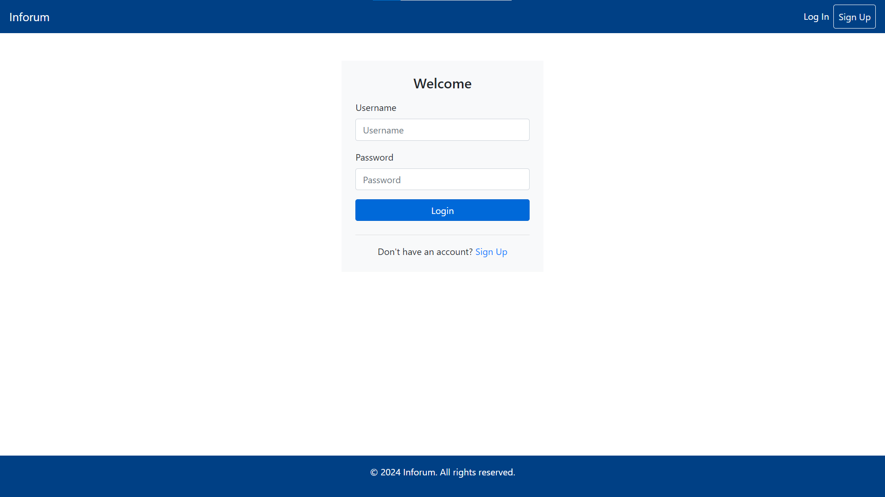
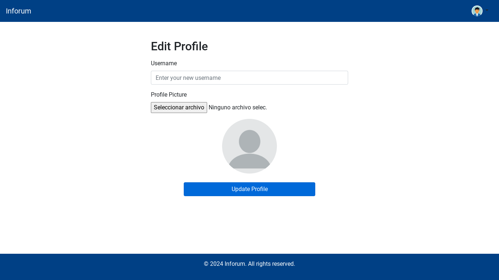

# 📚 Inforum

## 🚀 Our Team

| Nombre                 | Email                              | Github            |
| ---------------------- | ---------------------------------- | ----------------- |
| Jorge Carbonero Asín   | <j.carbonero.2021@alumnos.urjc.es> | JorgeCarbonero    |
| Juan Salguero Ibarrola | <j.salguero.2023@alumnos.urjc.es>  | jsalgueroibarrola |
| Adrián Dueñas Minguez  | <a.duenas.2021@alumnos.urjc.es>    | AdriDM-urjc       |
| Miguel Quero           | <m.quero.2021@alumnos.urjc.es>     | miguel-quero      |
| David Moreno Martín    | <d.moreno1.2019@alumnos.urjc.es>   | DavidMorenoo      |

## 🛠️ Tools

- [Trello](https://trello.com/invite/espaciodetrabajodeuser7a9834432e7b029c3b125e94682e86cc/ATTI8fd1de6f9901d870951c48995f21a12bA10FBC62)
- Confluence

## 📂 Entities


- **User:** The User entity contains personal and authentication information about the user.
- **Thread:** Represents a conversation within a Forum.
- **Post:** Represents a message within a Thread.
- **Forum:** Represents a specific category where users can create threads.

## 🔐 User Permissions

- **Anonymous**: The basic user, does not have an account. Can enter forums, read threads and register an account.
- **Registered**: Has created an account and is logged in. Can read and take part in forums by creating threads and posts, and edit and delete his account.
- **Administrator**: Has all the functionality of a registered user plus the ability to create, edit or delete forums, threads, and messages.

## 🖼️ Images

- Users can have profile pictures and posts can have an image attached to them.

## 📊 Graphs

- Users with an account can visualize how many threads they have created each month of the past year, the same can be done with posts.

## 📧 Complementary Technology

- We will send new users emails to activate their accounts.
- Users that want to change their passwords will be sent a password recovery email.

## 📈 Algorithm

- Anonymous users will be shown a list of the most trending threads in the last 2 days.
- For registered users, this list will be filtered to only show threads from forums where they are active.

---

# Phase 1

## 🖥️ Screens

### Home Screen

Home screen of our application, from here, we will be able to enter any of the available categories, and in addition, we will also be able to observe the categories in trendig. This home screen also has 2 buttons at the top right, these buttons are to log in or register if the user wishes.

Note that it is not necessary to be registered to navigate between the categories, but your actions will be limited.


### Login Screen

Login screen, here we can log in if we already have an account created, to do so, we must enter our username and password, once logged in, the user will be moved back to the home screen.

In case we do not have an account, we will also have the option to go to the registration screen from this same screen.



### Register Screen

Registration screen, from here, we can register on the web, and thus, to create threads and posts, as well as to write messages within the posts.

To register you will need a username, which you will enter when you log in, an email and a password, it is important to have access to the email because it will be necessary to perform a verification before you can create the account.

In case you already have an account, you can go to the login tab from this same screen.


### forum Screen

Forum screen, here we can see the list of threads created in the selected forum, whether you are a registered user or not, you can click on one of these threads and access it, but to participate you will need to have an account.
Next to the thread name, you will also see the number of posts it has.

In this screen we also have a shortcut to the categories/forums, so we don't have to go back to the home screen if we want to change it.


### Thread Screen

Anonymous users can see all post made in the thread but cant interact with them nor can they add posts. They can also navigate to other forum categories from here.


### Thread Screen (Registered)

Registered users will be able to see, interact and report all posts from the thread and contribute with their own post which they then can edit or delete. They can also navigate to other forum categories from here.


### Thread Screen (Admin)

Administrators can contribute to threads the same way registered users can. In addition, they can delete the thread and edit or delete any post within it. They can also navigate to other forum categories from here.


### Edit Profile Screen

Users can update their profile anytime they want. They can change their current username and/or upload a new profile picture. When the updated version of their profile is ready, they can click in update in order to register the changes they made.



### Profile Screen Registered

Profile Screen Registered, this page displays the profile of the registered user. It consists of a user image, username, number of posts created, and number of threads. In addition, you can see the threads in which the user has participated along with the number of posts published.


### Profile Screen Admin

Profile Screen Registered, this page displays the administrator's profile. It consists of a user image, username, number of posts created, and number of threads. In addition, you can see the threads in which the user has participated along with the number of posts published. Finally, the administrator will have an option to delete the account since they have permissions to do so.


### Charts Screen

Charts Screen, here is a histogram that summarizes the statistics of the posts created by the user, weekly, monthly, or annually.


### Users Screen (Admin)

Administrators can manage other users freely. There is a searchbar to find specific users or they can browse the whole list. They can view users profile, modify it and even delete it if its needed.


### Reports Screen

Here there will be displayed a list of recently reported posts and how many reports each one of them has. There is also a link to each respective post and a shortcut to modify or delete the post.


## 🗺️ Navigation Diagram


---

# Phase 2

## 🗺️ Navigation Diagram


## 🖥️ Execution Guidelines

- For the implementation of the application we have used GitHub Desktop, Docker desktop and Visual Studio Code.

- In order to run the application in Visual Studio Code it is necessary to install the "Extension Pack for Java" and "Spring Boot Extension Pack" extensions. Note that we have used Spring Boot 3.2.2 for the application.

- Once that is done, the first thing to do would be to clone the repository and place yourself on the main branch, once in main, with Visual Studio (or the editor you use) open the folder

```
backend/src/main/java/es/codeurjc/backend
```

- This is the folder where all the application code is located.

- When you are already inside the folder, you look for the file "BackendApplication.java" which is the main file of the program and the one that will start the application.
- Before doing this, it is important to have the database available. In our case, we have chosen to do it using docker. Specifically for everything to work, we must have the image and the container built and started in docker desktop. To do this, we must be located in the folder

```
backend/docker
```

- And run the command:

```
docker build -t mysql_daw .
```

- And then:

```
docker run -d --name inforum_mysql -p 3306:3306 mysql_daw --default-authentication-plugin=mysql_native_password
```

- The first one is used to build a Docker image using a Dockerfile present in the current directory (.). The -t option allows you to assign a name and optionally a label to the image. In this case, you are calling the image mysql_daw.

- After building the image, we must run a container based on that image. This command starts a container called inforum_mysql, runs it in the background (-d), maps port 3306 on the host to port 3306 in the container (-p 3306:3306), and specifies the image you just built (mysql_daw). It also includes the option --default-authentication-plugin=mysql_native_password, which sets the default authentication plugin for MySQL.

- Once we have the database instance, we execute the "BackendApplication.java" file and we will see how the database is connected to the application and the tables with their respective data are created. When it is finished, we will be able to use the application.
- To do this, we must go in our browser to "https://localhost:8443" and when we get the warning that the connection is not private we must click on "Advanced" and then on "Proceed to localhost (unsafe)".
- If we have done everything correctly, we will be inside the application, with all the functionalities and data loaded.

## 📂 Entities Diagram


- **User:** The User entity contains personal and authentication information about the user.
- **Forum:** Represents a specific category where users can create threads.
- **Thread:** Represents a conversation within a Forum.
- **Post:** Represents a message within a Thread.

## 📊 Class and Template Diagram

## 🚀 Member participation

### David Moreno Martín

#### Descripción textual:

xxxx

#### 5 commits más significativos

| Commit | Descripción                                          | Link                                                                                            |
| ------ | ---------------------------------------------------- | ----------------------------------------------------------------------------------------------- |
| #1     | Angular routing and Error 404 page                   | https://github.com/CodeURJC-DAW-2022-23/webapp4/commit/faf6833f02d92a2a2e26fadf8b73201adedc1854 |
| #2     | Angular Proxy integrated and API destinations format | https://github.com/CodeURJC-DAW-2022-23/webapp4/commit/b4374b60de88c73f82bdbf35b6026eb595bfb188 |
| #3     | Angular localhost deployment in port 8443/new/       | https://github.com/CodeURJC-DAW-2022-23/webapp4/commit/93ea3c2b7d571ec84daac57f07418dcd88b04fb4 |
| #4     | Bar chart added via API                              | https://github.com/CodeURJC-DAW-2022-23/webapp4/commit/bb3b7d29f7a256c5afd2f1ceeeff84c0040a7247 |
| #5     | House components and details                         | https://github.com/CodeURJC-DAW-2022-23/webapp4/commit/46db2496f2e28a764b64b8ef46ba09955c18fe35 |

#### 5 ficheros más participación

| Número fichero | Fichero                                                                                                                                                  |
| -------------- | -------------------------------------------------------------------------------------------------------------------------------------------------------- |
| #1             | [error-page Component](https://github.com/CodeURJC-DAW-2022-23/webapp4/tree/DesarrolloAngular2/allCode/frontend/src/app/components/error-page)           |
| #2             | [destination Components](https://github.com/CodeURJC-DAW-2022-23/webapp4/tree/DesarrolloAngular2/allCode/frontend/src/app/components/destination)        |
| #3             | [rating Component](https://github.com/CodeURJC-DAW-2022-23/webapp4/tree/DesarrolloAngular2/allCode/frontend/src/app/components/rating)                   |
| #4             | [house Component](https://github.com/CodeURJC-DAW-2022-23/webapp4/tree/DesarrolloAngular2/allCode/frontend/src/app/components/destination/house)         |
| #5             | [public/new Deployment](https://github.com/CodeURJC-DAW-2022-23/webapp4/tree/DesarrolloAngular2/allCode/Backend/idealTrip/src/main/resources/public/new) |

### Juan Salguero Ibarrola

#### Descripción textual:

I set up the project base with all dependencies, security, MySQL connection, and database creation with Docker. I have implemented the email sending system, statistics generation, pagination, and the entire image system. The screens that I have created are user listing, edit profile, show profile, display the custom error screen, the chart screen, the navbar differentiating between logged in and not logged in users, and the entire user activation system.

#### 5 commits más significativos

| Commit | Descripción                                                    | Link                                                                                             |
| ------ | -------------------------------------------------------------- | ------------------------------------------------------------------------------------------------ |
| #1     | implementation email verification for account activation       | https://github.com/CodeURJC-DAW-2023-24/webapp06/commit/1079ce988111789ac53597399cd1cc77affc1b58 |
| #2     | Enhance chart.js and chart_template to display post statistics | https://github.com/CodeURJC-DAW-2023-24/webapp06/commit/30dc1d5295eaf569c70949df9d4022b0c87b9b4a |
| #3     | Improved performance of user deletion process                  | https://github.com/CodeURJC-DAW-2023-24/webapp06/commit/0acc1f72e4650b2b1999ea068373f52b02d2425b |
| #4     | Add chart and REST controllers for threads                     | https://github.com/CodeURJC-DAW-2023-24/webapp06/commit/329d4733cb21f99717ba764d50bceb7457a65f13 |
| #5     | Improved pagination and added pagination to forum                                   | https://github.com/CodeURJC-DAW-2023-24/webapp06/commit/728a361bad3b80b9e13621c33d415272a9fec7ac  |

#### 5 ficheros con más participación

| Número fichero | Fichero                                                                                                                                                  |
| -------------- | -------------------------------------------------------------------------------------------------------------------------------------------------------- |
| #1             | [error-page Component](https://github.com/CodeURJC-DAW-2022-23/webapp4/tree/DesarrolloAngular2/allCode/frontend/src/app/components/error-page)           |
| #2             | [destination Components](https://github.com/CodeURJC-DAW-2022-23/webapp4/tree/DesarrolloAngular2/allCode/frontend/src/app/components/destination)        |
| #3             | [rating Component](https://github.com/CodeURJC-DAW-2022-23/webapp4/tree/DesarrolloAngular2/allCode/frontend/src/app/components/rating)                   |
| #4             | [house Component](https://github.com/CodeURJC-DAW-2022-23/webapp4/tree/DesarrolloAngular2/allCode/frontend/src/app/components/destination/house)         |
| #5             | [public/new Deployment](https://github.com/CodeURJC-DAW-2022-23/webapp4/tree/DesarrolloAngular2/allCode/Backend/idealTrip/src/main/resources/public/new) |


### Miguel Quero Prieto

#### Descripción textual:

In our practice, I've been actively involved in enhancing our web application's functionality. My contributions have been pivotal in implementing crucial features such as visualizing Tendring Categories based on user types, displaying all application categories, completing the registration process, handling errors on the registration screen, and implementing SQL algorithms. I've played a significant role in key files like the Register Controller, Forum Repository, Forum Service, Home Screen HTML, and Register Screens HTML. Through my commits, I've demonstrated my commitment to driving the project forward and ensuring its success.

#### 5 commits más significativos

| Commit | Descripción                                                    | Link                                                                                             |
| ------ | -------------------------------------------------------------- | ------------------------------------------------------------------------------------------------ |
| #1     | Visualize the Tendring Categories according to the type of user| https://github.com/CodeURJC-DAW-2023-24/webapp06/commit/aff66d340066cf886121fb11efa10710938a1cdc |
| #2     | Visualize all the categories of the application                | https://github.com/CodeURJC-DAW-2023-24/webapp06/commit/50b3d59c52140a8ef84d6024bd95fd2a6f893b8d |
| #3     | Complete the registration process                              | https://github.com/CodeURJC-DAW-2023-24/webapp06/commit/cfad0c27fec079c17c4d8977bf424c11c32ba5d8 |
| #4     | Error handling for the registration screen                     | https://github.com/CodeURJC-DAW-2023-24/webapp06/commit/683ea0177fe684dbd0b138c1dc5f70ab1550a71c |
| #5     | Complete SQL algorithms                                        | https://github.com/CodeURJC-DAW-2023-24/webapp06/commit/aff66d340066cf886121fb11efa10710938a1cdc  |

#### 5 ficheros con más participación

| Número fichero | Fichero                                                                                                                                                  |
| -------------- | -------------------------------------------------------------------------------------------------------------------------------------------------------- |
| #1             | [Register Controller](https://github.com/CodeURJC-DAW-2023-24/webapp06/tree/develop/backend/src/main/java/es/codeurjc/backend/controller/RegisterController.java)           |
| #2             | [Forum Repository](https://github.com/CodeURJC-DAW-2023-24/webapp06/tree/develop/backend/src/main/java/es/codeurjc/backend/repository/ForumRepository.java)        |
| #3             | [Forum Service](https://github.com/CodeURJC-DAW-2023-24/webapp06/tree/develop/backend/src/main/java/es/codeurjc/backend/service/ForumService.java)                   |
| #4             | [Home Screen HTML](https://github.com/CodeURJC-DAW-2023-24/webapp06/tree/develop/backend/src/main/resources/templates/home.html)         |
| #5             | [Register Screens HTML](https://github.com/CodeURJC-DAW-2023-24/webapp06/tree/develop/backend/src/main/resources/templates/register.html) |


