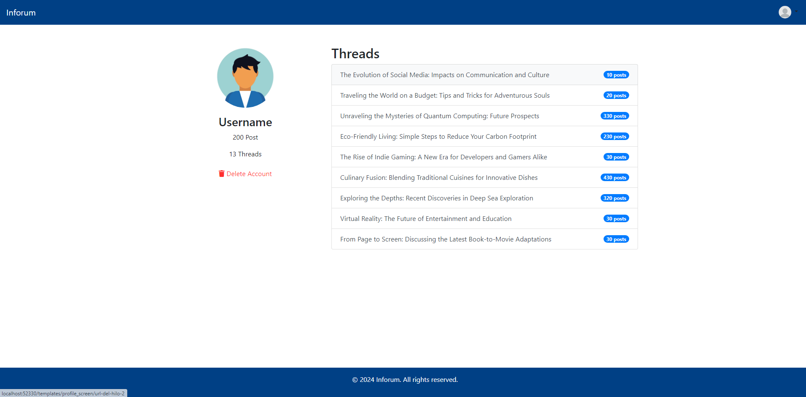
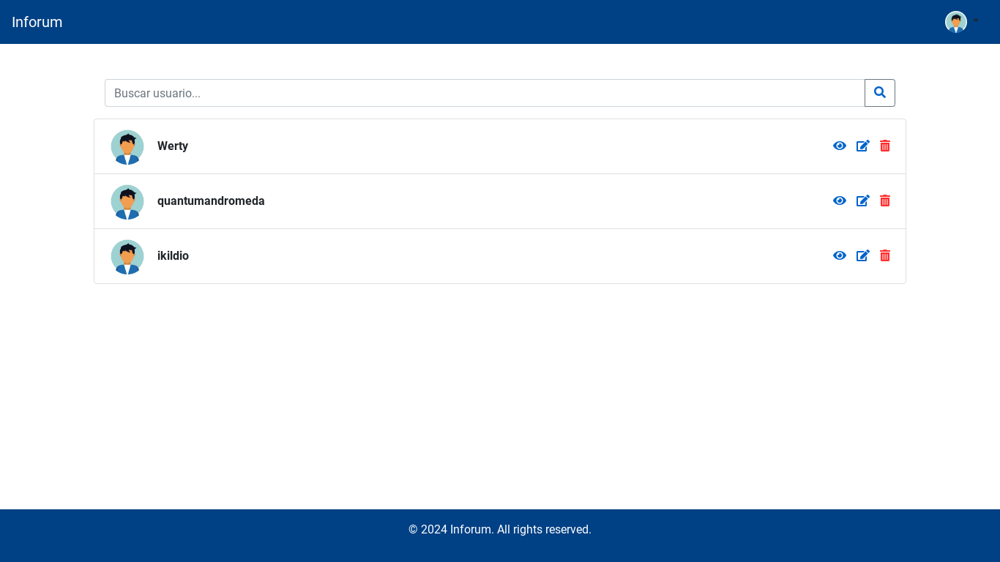

# 📚 Inforum

## 🚀 Our Team

| Nombre                 | Email                              | Github            |
| ---------------------- | ---------------------------------- | ----------------- |
| Jorge Carbonero Asín   | <j.carbonero.2021@alumnos.urjc.es> | JorgeCarbonero    |
| Juan Salguero Ibarrola | <j.salguero.2023@alumnos.urjc.es>  | jsalgueroibarrola |
| Adrián Dueñas Minguez  | <a.duenas.2021@alumnos.urjc.es>    | AdriDM-urjc       |
| Miguel Quero           | <m.quero.2021@alumnos.urjc.es>     | miguel-quero      |
| David Moreno Martín    | <d.moreno1.2019@alumnos.urjc.es>   | DavidMorenoo      |

## 🛠️ Tools

- [Trello](https://trello.com/invite/espaciodetrabajodeuser7a9834432e7b029c3b125e94682e86cc/ATTI8fd1de6f9901d870951c48995f21a12bA10FBC62)
- Confluence

## 📂 Entities


- **User:** The User entity contains personal and authentication information about the user.
- **Thread:** Represents a conversation within a Forum.
- **Post:** Represents a message within a Thread.
- **Forum:** Represents a specific category where users can create threads.

## 🔐 User Permissions

- **Anonymous**: The basic user, does not have an account. Can enter forums, read threads and register an account.
- **Registered**: Has created an account and is logged in. Can read and take part in forums by creating threads and posts, and edit and delete his account.
- **Administrator**: Has all the functionality of a registered user plus the ability to create, edit or delete forums, threads, and messages.

## 🖼️ Images

- Users can have profile pictures and posts can have an image attached to them.

## 📊 Graphs

- Users with an account can visualize how many threads they have created each month of the past year, the same can be done with posts.

## 📧 Complementary Technology

- We will send new users emails to activate their accounts.
- Users that want to change their passwords will be sent a password recovery email.

## 📈 Algorithm

- Anonymous users will be shown a list of the most trending threads in the last 2 days.
- For registered users, this list will be filtered to only show threads from forums where they are active.

---

# Phase 1

## 🖥️ Screens

### Home Screen

Home screen of our application, from here, we will be able to enter any of the available categories, and in addition, we will also be able to observe the categories in trendig. This home screen also has 2 buttons at the top right, these buttons are to log in or register if the user wishes.

Note that it is not necessary to be registered to navigate between the categories, but your actions will be limited.


### Login Screen

Login screen, here we can log in if we already have an account created, to do so, we must enter our username and password, once logged in, the user will be moved back to the home screen.

In case we do not have an account, we will also have the option to go to the registration screen from this same screen.


### Register Screen

Registration screen, from here, we can register on the web, and thus, to create threads and posts, as well as to write messages within the posts.

To register you will need a username, which you will enter when you log in, an email and a password, it is important to have access to the email because it will be necessary to perform a verification before you can create the account.

In case you already have an account, you can go to the login tab from this same screen.


### forum Screen

Forum screen, here we can see the list of threads created in the selected forum, whether you are a registered user or not, you can click on one of these threads and access it, but to participate you will need to have an account.
Next to the thread name, you will also see the number of posts it has.

In this screen we also have a shortcut to the categories/forums, so we don't have to go back to the home screen if we want to change it.


### Thread Screen

Anonymous users can see all post made in the thread but cant interact with them nor can they add posts. They can also navigate to other forum categories from here.


### Thread Screen (Registered)

Registered users will be able to see, interact and report all posts from the thread and contribute with their own post which they then can edit or delete. They can also navigate to other forum categories from here.


### Thread Screen (Admin)

Administrators can contribute to threads the same way registered users can. In addition, they can delete the thread and edit or delete any post within it. They can also navigate to other forum categories from here.


### Edit Profile Screen

Users can update their profile anytime they want. They can change their current username and/or upload a new profile picture. When the updated version of their profile is ready, they can click in update in order to register the changes they made.


### Profile Screen Registered

Profile Screen Registered, this page displays the profile of the registered user. It consists of a user image, username, number of posts created, and number of threads. In addition, you can see the threads in which the user has participated along with the number of posts published.


### Profile Screen Admin

Profile Screen Registered, this page displays the administrator's profile. It consists of a user image, username, number of posts created, and number of threads. In addition, you can see the threads in which the user has participated along with the number of posts published. Finally, the administrator will have an option to delete the account since they have permissions to do so.



### Charts Screen

Charts Screen, here is a histogram that summarizes the statistics of the posts created by the user, weekly, monthly, or annually.


### Users Screen (Admin)

Administrators can manage other users freely. There is a searchbar to find specific users or they can browse the whole list. They can view users profile, modify it and even delete it if its needed.



### Reports Screen

Here there will be displayed a list of recently reported posts and how many reports each one of them has. There is also a link to each respective post and a shortcut to modify or delete the post.


## 🗺️ Navigation Diagram


---

# Phase 2

## 🗺️ Navigation Diagram


## 🖥️ Execution Guidelines

- For the implementation of the application we have used GitHub Desktop, Docker desktop and Visual Studio Code.

- In order to run the application in Visual Studio Code it is necessary to install the "Extension Pack for Java" and "Spring Boot Extension Pack" extensions. Note that we have used Spring Boot 3.2.2 for the application.

- Once that is done, the first thing to do would be to clone the repository and place yourself on the main branch, once in main, with Visual Studio (or the editor you use) open the folder

```
backend/src/main/java/es/codeurjc/backend
```

- This is the folder where all the application code is located.

- When you are already inside the folder, you look for the file "BackendApplication.java" which is the main file of the program and the one that will start the application.
- Before doing this, it is important to have the database available. In our case, we have chosen to do it using docker. Specifically for everything to work, we must have the image and the container built and started in docker desktop. To do this, we must be located in the folder

```
backend/docker
```

- And run the command:

```
docker build -t mysql_daw .
```

- And then:

```
docker run -d --name inforum_mysql -p 3306:3306 mysql_daw --default-authentication-plugin=mysql_native_password
```

- The first one is used to build a Docker image using a Dockerfile present in the current directory (.). The -t option allows you to assign a name and optionally a label to the image. In this case, you are calling the image mysql_daw.

- After building the image, we must run a container based on that image. This command starts a container called inforum_mysql, runs it in the background (-d), maps port 3306 on the host to port 3306 in the container (-p 3306:3306), and specifies the image you just built (mysql_daw). It also includes the option --default-authentication-plugin=mysql_native_password, which sets the default authentication plugin for MySQL.

- Once we have the database instance, we execute the "BackendApplication.java" file and we will see how the database is connected to the application and the tables with their respective data are created. When it is finished, we will be able to use the application.
- To do this, we must go in our browser to "https://localhost:8443" and when we get the warning that the connection is not private we must click on "Advanced" and then on "Proceed to localhost (unsafe)".
- If we have done everything correctly, we will be inside the application, with all the functionalities and data loaded.

## 📂 Entities Diagram


- **User:** The User entity contains personal and authentication information about the user.
- **Forum:** Represents a specific category where users can create threads.
- **Thread:** Represents a conversation within a Forum.
- **Post:** Represents a message within a Thread.

## 📊 Class and Template Diagram


## 🚀 Member participation

### Juan Salguero Ibarrola

#### Text description:

I set up the project base with all dependencies, security, MySQL connection, and database creation with Docker. I have implemented the email sending system, statistics generation, pagination, and the entire image system. The screens that I have created are user listing, edit profile, show profile, display the custom error screen, the chart screen, the navbar differentiating between logged in and not logged in users, and the entire user activation system.

#### My 5 most significant commits

| Commit | Descripción                                                    | Link                                                                                             |
| ------ | -------------------------------------------------------------- | ------------------------------------------------------------------------------------------------ |
| #1     | implementation email verification for account activation       | https://github.com/CodeURJC-DAW-2023-24/webapp06/commit/1079ce988111789ac53597399cd1cc77affc1b58 |
| #2     | Enhance chart.js and chart_template to display post statistics | https://github.com/CodeURJC-DAW-2023-24/webapp06/commit/30dc1d5295eaf569c70949df9d4022b0c87b9b4a |
| #3     | Improved performance of user deletion process                  | https://github.com/CodeURJC-DAW-2023-24/webapp06/commit/0acc1f72e4650b2b1999ea068373f52b02d2425b |
| #4     | Add chart and REST controllers for threads                     | https://github.com/CodeURJC-DAW-2023-24/webapp06/commit/329d4733cb21f99717ba764d50bceb7457a65f13 |
| #5     | Improved pagination and added pagination to forum              | https://github.com/CodeURJC-DAW-2023-24/webapp06/commit/728a361bad3b80b9e13621c33d415272a9fec7ac |

#### The 5 files where I participated the most

| Número fichero | Fichero                                                                                                                                                                   |
| -------------- | ------------------------------------------------------------------------------------------------------------------------------------------------------------------------- |
| #1             | [UserController.java](https://github.com/CodeURJC-DAW-2023-24/webapp06/blame/main/backend/src/main/java/es/codeurjc/backend/controller/UserController.java)               |
| #2             | [ChartRestController.java](https://github.com/CodeURJC-DAW-2023-24/webapp06/blame/main/backend/src/main/java/es/codeurjc/backend/restcontroller/ChartRestController.java) |
| #3             | [paginated.js](https://github.com/CodeURJC-DAW-2023-24/webapp06/blame/main/backend/src/main/resources/static/js/paginated.js)                                             |
| #4             | [ThreadRepository.java](https://github.com/CodeURJC-DAW-2023-24/webapp06/blame/main/backend/src/main/java/es/codeurjc/backend/repository/ThreadRepository.java)           |
| #5             | [EmailService.java](https://github.com/CodeURJC-DAW-2023-24/webapp06/blob/main/backend/src/main/java/es/codeurjc/backend/service/EmailService.java)                       |

### Miguel Quero Prieto

#### Text description:

In our practice, I've been actively involved in enhancing our web application's functionality. My contributions have been pivotal in implementing crucial features such as visualizing Trending Categories based on user types, displaying all application categories, completing the registration process, handling errors on the registration screen, and implementing SQL algorithms. I've played a significant role in key files like the Register Controller, Forum Repository, Forum Service, Home Screen HTML, and Register Screens HTML. Through my commits, I've demonstrated my commitment to driving the project forward and ensuring its success.

#### My 5 most significant commits

| Commit | Descripción                                                     | Link                                                                                             |
| ------ | --------------------------------------------------------------- | ------------------------------------------------------------------------------------------------ |
| #1     | Visualize the Tendring Categories according to the type of user | https://github.com/CodeURJC-DAW-2023-24/webapp06/commit/aff66d340066cf886121fb11efa10710938a1cdc |
| #2     | Visualize all the categories of the application                 | https://github.com/CodeURJC-DAW-2023-24/webapp06/commit/50b3d59c52140a8ef84d6024bd95fd2a6f893b8d |
| #3     | Complete the registration process                               | https://github.com/CodeURJC-DAW-2023-24/webapp06/commit/cfad0c27fec079c17c4d8977bf424c11c32ba5d8 |
| #4     | Error handling for the registration screen                      | https://github.com/CodeURJC-DAW-2023-24/webapp06/commit/683ea0177fe684dbd0b138c1dc5f70ab1550a71c |
| #5     | Complete SQL algorithms                                         | https://github.com/CodeURJC-DAW-2023-24/webapp06/commit/aff66d340066cf886121fb11efa10710938a1cdc |

#### The 5 files where I participated the most

| Número fichero | Fichero                                                                                                                                                           |
| -------------- | ----------------------------------------------------------------------------------------------------------------------------------------------------------------- |
| #1             | [Register Controller](https://github.com/CodeURJC-DAW-2023-24/webapp06/tree/develop/backend/src/main/java/es/codeurjc/backend/controller/RegisterController.java) |
| #2             | [Forum Repository](https://github.com/CodeURJC-DAW-2023-24/webapp06/tree/develop/backend/src/main/java/es/codeurjc/backend/repository/ForumRepository.java)       |
| #3             | [Forum Service](https://github.com/CodeURJC-DAW-2023-24/webapp06/tree/develop/backend/src/main/java/es/codeurjc/backend/service/ForumService.java)                |
| #4             | [Home Screen HTML](https://github.com/CodeURJC-DAW-2023-24/webapp06/tree/develop/backend/src/main/resources/templates/home_template.html)                         |
| #5             | [Register Screens HTML](https://github.com/CodeURJC-DAW-2023-24/webapp06/tree/develop/backend/src/main/resources/templates/register_template.html)                |

### Adrián Dueñas Minguez

#### Text description:

I helped my teammates in anyway I could, but I would like to highlight the role I played in the development of the functionalities around the threads, the dorsal spine of our proyect, and the posts. Specifically, I developed the functions that allow to create, edit and delete Posts from threads and most of the surrounding needs.

#### My 5 most significant commits

| Commit | Descripción          | Link                                                                                             |
| ------ | -------------------- | ------------------------------------------------------------------------------------------------ |
| #1     | addPost working      | https://github.com/CodeURJC-DAW-2023-24/webapp06/commit/9e8a061f6fdffa7c2534b33d31c309e7dd00502a |
| #2     | delete posts working | https://github.com/CodeURJC-DAW-2023-24/webapp06/commit/b29d7b2e9a882f59509a08e45ea8e316041ea55a |
| #3     | Edit post working    | https://github.com/CodeURJC-DAW-2023-24/webapp06/commit/613c1941c5ef19787a6c72ebe5b5cf525dce641a |
| #4     | Report screen set up | https://github.com/CodeURJC-DAW-2023-24/webapp06/commit/5618cf656629f369a96b2b2fe2c57b33cbad4999 |
| #5     | addPosts development | https://github.com/CodeURJC-DAW-2023-24/webapp06/commit/7350afefe409a9334e6ebb8d7379f70e9511fd70 |

#### The 5 files where I participated the most

| Número fichero | Fichero                                                                                                                                                                |
| -------------- | ---------------------------------------------------------------------------------------------------------------------------------------------------------------------- |
| #1             | [Thread Controller](https://github.com/CodeURJC-DAW-2023-24/webapp06/blob/develop/backend/src/main/java/es/codeurjc/backend/controller/ThreadController.java)          |
| #2             | [Thread.html](https://github.com/CodeURJC-DAW-2023-24/webapp06/blob/develop/backend/src/main/resources/templates/thread.html)                                          |
| #3             | [Post.js](https://github.com/CodeURJC-DAW-2023-24/webapp06/blob/develop/backend/src/main/resources/static/js/posts.js)                                                 |
| #4             | [Post Rest Controller](https://github.com/CodeURJC-DAW-2023-24/webapp06/blob/develop/backend/src/main/java/es/codeurjc/backend/restcontroller/PostRestController.java) |
| #5             | [Thread Service](https://github.com/CodeURJC-DAW-2023-24/webapp06/blob/develop/backend/src/main/java/es/codeurjc/backend/service/ThreadService.java)                   |

### David Moreno Martín

#### Text description:

I was in charge of the visualization of the different threads within each category or forum. I also made the login, login error, and logout along with their html screens, although later it was necessary to make several changes due to the security in spring 3.2.2. I also made the navigation from the home screen to the different forums. Finally I was also in charge of researching and implementing the Principal so that our application could distinguish within the app itself and interactively if you were logged into the application, in addition to making several requirements of the readme and a thorough code cleanup.

#### My 5 most significant commits

| Commit | Descripción                                 | Link                                                                                             |
| ------ | ------------------------------------------- | ------------------------------------------------------------------------------------------------ |
| #1     | Login and login error                       | https://github.com/CodeURJC-DAW-2023-24/webapp06/commit/8161fc705f584cd6809f4c4e446437e2a0d4fd05 |
| #2     | login working and css                       | https://github.com/CodeURJC-DAW-2023-24/webapp06/commit/63a1b765bdabc9128437cda518dda1dc567aeb26 |
| #3     | Register screen and navbar redirect         | https://github.com/CodeURJC-DAW-2023-24/webapp06/commit/458ba366349d45a9dd4fa39ce180dadf90e44105 |
| #4     | Threads in forum and navegation             | https://github.com/CodeURJC-DAW-2023-24/webapp06/commit/860f75e338a6b54b62aac30cc9d5c2975aa452df |
| #5     | ReadMe requirements update and code CleanUp | https://github.com/CodeURJC-DAW-2023-24/webapp06/commit/f156b228f322809ca08dc730885f97520fd65ffb |

#### The 5 files where I participated the most

| Número fichero | Fichero                                                                                                                                                      |
| -------------- | ------------------------------------------------------------------------------------------------------------------------------------------------------------ |
| #1             | [login_template.html](https://github.com/CodeURJC-DAW-2023-24/webapp06/blob/main/backend/src/main/resources/templates/login_template.html)                   |
| #2             | [LoginController.java](https://github.com/CodeURJC-DAW-2023-24/webapp06/blob/main/backend/src/main/java/es/codeurjc/backend/controller/LoginController.java) |
| #3             | [ForumController.java](https://github.com/CodeURJC-DAW-2023-24/webapp06/blob/main/backend/src/main/java/es/codeurjc/backend/controller/ForumController.java) |
| #4             | [Forum_template.html](https://github.com/CodeURJC-DAW-2023-24/webapp06/blob/main/backend/src/main/resources/templates/forum_template.html)                   |
| #5             | [README.md](https://github.com/CodeURJC-DAW-2023-24/webapp06/blob/main/README.md)                                                                            |

### Jorge Carbonero Asín

#### Text description:

I've mainly been in charge of the functionality of the app itself. My main contributions have been to thread visualization, making likes, dislikes and reports work. I have also been very involved in designing the database and fixing the issues that showed up around the app. I've also been testing the app and helping my teammates.

#### My 5 most significant commits

| Commit | Descripción                                     | Link                                                                                             |
| ------ | ----------------------------------------------- | ------------------------------------------------------------------------------------------------ |
| #1     | Posts liked and disliked are updated ServerSide | https://github.com/CodeURJC-DAW-2023-24/webapp06/commit/4f135f1173a1ed79c3b5e1605780655df8c16f98 |
| #2     | Report screen functionality added               | https://github.com/CodeURJC-DAW-2023-24/webapp06/commit/fc7aefcad9bbb95972c1c9b6db61da73244737d1 |
| #3     | Fixed reporting of posts                        | https://github.com/CodeURJC-DAW-2023-24/webapp06/commit/b91cb444b17b05225169da62ca5e2099bf9f49ba |
| #4     | Threads can be deleted                          | https://github.com/CodeURJC-DAW-2023-24/webapp06/commit/db61bc024d26fccff162a5f533e0cbd3753127fd |
| #5     | Posts can be reported                           | https://github.com/CodeURJC-DAW-2023-24/webapp06/commit/137563e76e665212c08c5bd4fe6d535a43f91673 |

#### The 5 files where I participated the most

| Número fichero | Fichero                                                                                                                                                              |
| -------------- | -------------------------------------------------------------------------------------------------------------------------------------------------------------------- |
| #1             | [Thread Controller](https://github.com/CodeURJC-DAW-2023-24/webapp06/blame/main/backend/src/main/java/es/codeurjc/backend/controller/ThreadController.java)          |
| #2             | [Post Service](https://github.com/CodeURJC-DAW-2023-24/webapp06/blame/main/backend/src/main/java/es/codeurjc/backend/service/PostService.java)                       |
| #3             | [Post](https://github.com/CodeURJC-DAW-2023-24/webapp06/blame/main/backend/src/main/java/es/codeurjc/backend/model/Post.java)                                        |
| #4             | [Post Rest Controller](https://github.com/CodeURJC-DAW-2023-24/webapp06/blame/main/backend/src/main/java/es/codeurjc/backend/restcontroller/PostRestController.java) |
| #5             | [likes.js](https://github.com/CodeURJC-DAW-2023-24/webapp06/blame/main/backend/src/main/resources/static/js/likes.js)                                                |

# Phase 3

## API REST documentation

The pom.xml is configured with various plugins that allow generating the REST API documentation in OpenAPI format (api-docs.yaml) and in HTML (api-docs.html) in the api-docs folder.

To do this, the command is executed:

```
    mvn verify
```

The REST API documentation is automatically generated and can be accessed in the following formats:

- [OpenAPI Specification (YAML)](https://github.com/CodeURJC-DAW-2023-24/webapp06/blob/develop/backend/api-docs/api-docs.yaml)
- [OpenAPI Specification (HTML)](https://rawcdn.githack.com/CodeURJC-DAW-2023-24/webapp06/faac735416132b7587d515b4aefea415206016dd/backend/api-docs/index.html)

## Docker Application Execution Instructions and Image Construction

1. Clone this repository

```
https://github.com/CodeURJC-DAW-2023-24/webapp06.git
```

2. Install Docker
3. Run Docker
4. Go to webapp06 folder

```
cd ./webapp6
```

5. Execute create_image.sh file

```
./create_image.sh
```

6. Execute run.sh file

```
./run.sh
```

## Virtual Machine Application URL and Example Users

The application is deployed and can be accessed at the following URL: https://10.100.139.188:8443

### Admin

- username: Admin
- password: password2

### User

- username: User
- password: password1

## Diagram


## Members Participation Phase 3

## 🚀 Member participation

### Juan Salguero Ibarrola

#### My 5 most significant commits

| Commit | Descripción                                      | Link                                                                                             |
| ------ | ------------------------------------------------ | ------------------------------------------------------------------------------------------------ |
| #1     | add ChartApiRestController                       | https://github.com/CodeURJC-DAW-2023-24/webapp06/commit/87cc1ccaf3cbe7863a7010b13ed72a7cd01481a3 |
| #2     | new DockerfileSpring                             | https://github.com/CodeURJC-DAW-2023-24/webapp06/commit/7bbb5109602af4a1695025d6c9ef7ee8a74c0305 |
| #3     | add docker-compose                               | https://github.com/CodeURJC-DAW-2023-24/webapp06/commit/8fdf9da48988fab9cc3e940171c712c6b7807ade |
| #4     | add jwt security                                 | https://github.com/CodeURJC-DAW-2023-24/webapp06/commit/f423a1df0c85e0fb2acaded3bc67b9af7690ebfb |
| #5     | Added automatic OpenAPI documentation generation | https://github.com/CodeURJC-DAW-2023-24/webapp06/commit/fab3ca7ce85c04ff0c00303f29bbdd0dcd3b21bc |

#### The 5 files where I participated the most

| Número fichero | Fichero                                                                                                                                                                   |
| -------------- | ------------------------------------------------------------------------------------------------------------------------------------------------------------------------- |
| #1             | [ChartApiController.java](https://github.com/CodeURJC-DAW-2023-24/webapp06/blob/develop/backend/src/main/java/es/codeurjc/backend/api/ChartApiController.java)            |
| #2             | [DockerfileSpring](https://github.com/CodeURJC-DAW-2023-24/webapp06/blob/develop/docker/DockerfileSpring)                                                                 |
| #3             | [docker-compose](https://github.com/CodeURJC-DAW-2023-24/webapp06/blob/develop/docker/docker-compose.yml)                                                                 |
| #4             | [ChartService.java](https://github.com/CodeURJC-DAW-2023-24/webapp06/blob/develop/backend/src/main/java/es/codeurjc/backend/service/ChartService.java)                    |
| #5             | [SecurityConfiguration.java](https://github.com/CodeURJC-DAW-2023-24/webapp06/blob/develop/backend/src/main/java/es/codeurjc/backend/security/SecurityConfiguration.java) |

### Jorge Carbonero Asín

#### My 5 most significant commits

| Commit | Descripción                                                     | Link                                                                                             |
| ------ | --------------------------------------------------------------- | ------------------------------------------------------------------------------------------------ |
| #1     | Mostly working postApi and removed unused files                 | https://github.com/CodeURJC-DAW-2023-24/webapp06/commit/4f135f1173a1ed79c3b5e1605780655df8c16f98 |
| #2     | Mostly finished PostApi                                         | https://github.com/CodeURJC-DAW-2023-24/webapp06/commit/fc7aefcad9bbb95972c1c9b6db61da73244737d1 |
| #3     | PostApi accepts images                                          | https://github.com/CodeURJC-DAW-2023-24/webapp06/commit/b91cb444b17b05225169da62ca5e2099bf9f49ba |
| #4     | Login to api available via LoginRestController                  | https://github.com/CodeURJC-DAW-2023-24/webapp06/commit/db61bc024d26fccff162a5f533e0cbd3753127fd |
| #5     | Like, dislike and report post available to all registered users | https://github.com/CodeURJC-DAW-2023-24/webapp06/commit/137563e76e665212c08c5bd4fe6d535a43f91673 |

#### The 5 files where I participated the most

| Número fichero | Fichero                                                                                                                                                                       |
| -------------- | ----------------------------------------------------------------------------------------------------------------------------------------------------------------------------- |
| #1             | [Post Api Rest Controller](https://github.com/CodeURJC-DAW-2023-24/webapp06/blame/main/backend/src/main/java/es/codeurjc/backend/restcontroller/PostApiRestController.java)   |
| #2             | [Post Service](https://github.com/CodeURJC-DAW-2023-24/webapp06/blame/main/backend/src/main/java/es/codeurjc/backend/service/PostService.java)                                |
| #3             | [Post Add DTO](https://github.com/CodeURJC-DAW-2023-24/webapp06/blame/main/backend/src/main/java/es/codeurjc/backend/dto/PostAddDTO.java)                                     |
| #4             | [Login Api Rest Controller](https://github.com/CodeURJC-DAW-2023-24/webapp06/blame/main/backend/src/main/java/es/codeurjc/backend/restcontroller/LoginApiRestController.java) |
| #5             | [Post DTO](https://github.com/CodeURJC-DAW-2023-24/webapp06/blame/main/backend/src/main/java/es/codeurjc/backend/dto/PostDTO.java)                                            |

### David Moreno Martín

#### My 5 most significant commits

| Commit | Descripción                                                                                                                                    | Link                                                                                             |
| ------ | ---------------------------------------------------------------------------------------------------------------------------------------------- | ------------------------------------------------------------------------------------------------ |
| #1     | ForumTrending now works properly, Now the API detects if the user is logged in or not, and depending on that it shows you one thing or another | https://github.com/CodeURJC-DAW-2023-24/webapp06/commit/9f26d7d34a8818ca2cd19d2e482fd6a2871b3c6f |
| #2     | Forum Trending API Rest                                                                                                                        | https://github.com/CodeURJC-DAW-2023-24/webapp06/commit/c5e053182d5ac7aed7f5de4bb95c09f812f52057 |
| #3     | Forum by Id fixed                                                                                                                              | https://github.com/CodeURJC-DAW-2023-24/webapp06/commit/ccc72f99c94d819c7772f0ef723760d81245fc55 |
| #4     | Forum.java to improve API display                                                                                                              | https://github.com/CodeURJC-DAW-2023-24/webapp06/commit/d4525083bb4fbbc7ba8d5c0fb55edb41102be6e2 |
| #5     | Forums API Rest Update                                                                                                                         | https://github.com/CodeURJC-DAW-2023-24/webapp06/commit/cdd46b5751f151cbbeded9070a39f7cd96eb4664 |

#### The 5 files where I participated the most

| Número fichero | Fichero                                                                                                                                                                                      |
| -------------- | -------------------------------------------------------------------------------------------------------------------------------------------------------------------------------------------- |
| #1             | [Forum Api Rest Controller](https://github.com/CodeURJC-DAW-2023-24/webapp06/blob/develop/backend/src/main/java/es/codeurjc/backend/restcontroller/ForumApiRestController.java)              |
| #2             | [Forum Trending Rest Controller](https://github.com/CodeURJC-DAW-2023-24/webapp06/blob/develop/backend/src/main/java/es/codeurjc/backend/restcontroller/ForumTrendingApiRestController.java) |
| #3             | [Forum Service](https://github.com/CodeURJC-DAW-2023-24/webapp06/blob/develop/backend/src/main/java/es/codeurjc/backend/service/ForumService.java)                                           |
| #4             | [Forum Not Found Exception](https://github.com/CodeURJC-DAW-2023-24/webapp06/blob/develop/backend/src/main/java/es/codeurjc/backend/exceptions/ForumNotFoundException.java)                  |
| #5             | [Forum](https://github.com/CodeURJC-DAW-2023-24/webapp06/blob/develop/backend/src/main/java/es/codeurjc/backend/model/Forum.java)                                                            |

### Adrián Dueñas Minguez

#### My most significant commits

| Commit | Descripción       | Link                                                                                             |
| ------ | ----------------- | ------------------------------------------------------------------------------------------------ |
| #1     | ThreadApi basic   | https://github.com/CodeURJC-DAW-2023-24/webapp06/commit/892cd3cb9a0286ad3b8cdbb7bff16e6ad19fec64 |
| #2     | Create new Thread | https://github.com/CodeURJC-DAW-2023-24/webapp06/commit/f266095584b110f86402c38aa645e295a8626a18 |

#### The files where I participated the most

| Número fichero | Fichero                                                                                                                                                                     |
| -------------- | --------------------------------------------------------------------------------------------------------------------------------------------------------------------------- |
| #1             | [ThreadApiRestController](https://github.com/CodeURJC-DAW-2023-24/webapp06/blob/main/backend/src/main/java/es/codeurjc/backend/restcontroller/ThreadApiRestController.java) |
| #2             | [ThreadDTO](https://github.com/CodeURJC-DAW-2023-24/webapp06/blob/main/backend/src/main/java/es/codeurjc/backend/dto/ThreadDTO.java)                                        |
| #3             | [ThreadAddDTO](https://github.com/CodeURJC-DAW-2023-24/webapp06/blob/main/backend/src/main/java/es/codeurjc/backend/dto/ThreadAddDTO.java)                                  |
| #4             | [SecurityConfiguration](https://github.com/CodeURJC-DAW-2023-24/webapp06/blob/main/backend/src/main/java/es/codeurjc/backend/security/SecurityConfiguration.java)           |

### Miguel Quero Prieto

#### Text description:

During this practice, I focused on enhancing the functionality of the web application backend by implementing various features and improvements. My contributions mainly revolved around refining the API operations, enhancing documentation with Swagger annotations, adding missing methods to the API, and improving the user creation method.

#### My 5 most significant commits

| Commit | Description                                                       | Link                                                                                             |
| ------ | ----------------------------------------------------------------- | ------------------------------------------------------------------------------------------------ |
| #1     | Add the API operations to the User REST controller                | https://github.com/CodeURJC-DAW-2023-24/webapp06/commit/457d35fdc99db2ea1934d60c438e4acf8779768a |
| #2     | Add the annotations and comments for documentation with Swagger   | https://github.com/CodeURJC-DAW-2023-24/webapp06/commit/457d35fdc99db2ea1934d60c438e4acf8779768a |
| #3     | Add missing methods to the API and display images in the requests | https://github.com/CodeURJC-DAW-2023-24/webapp06/commit/2f2dbe75d4f4c85bf613c6bbb1846d98900b3919 |
| #4     | Improve the method for creating a user in the API                 | https://github.com/CodeURJC-DAW-2023-24/webapp06/commit/f8a89f2bd48329906b62a4cdb0a0545ce388babe |
| #5     | Fixed creating user in the api                                    | https://github.com/CodeURJC-DAW-2023-24/webapp06/commit/23dc34bd6432fc89833d2531ae10ff5c149df1b6 |

#### The 5 files where I participated the most

| Número fichero | Fichero                                                                                                                                                                    |
| -------------- | -------------------------------------------------------------------------------------------------------------------------------------------------------------------------- |
| #1             | [User Api Rest Controller](https://github.com/CodeURJC-DAW-2023-24/webapp06/blob/main/backend/src/main/java/es/codeurjc/backend/restcontroller/UserApiRestController.java) |
| #2             | [Data Loader](https://github.com/CodeURJC-DAW-2023-24/webapp06/blob/main/backend/src/main/java/es/codeurjc/backend/loader/DataLoader.java)                                 |
| #3             | [User Service](https://github.com/CodeURJC-DAW-2023-24/webapp06/blob/main/backend/src/main/java/es/codeurjc/backend/service/UserService.java)                              |
| #4             | [Security Configuration](https://github.com/CodeURJC-DAW-2023-24/webapp06/blob/main/backend/src/main/java/es/codeurjc/backend/security/SecurityConfiguration.java)         |
| #5             | [User DTO](https://github.com/CodeURJC-DAW-2023-24/webapp06/blob/main/backend/src/main/java/es/codeurjc/backend/dto/UserDTO.java)                                          |

<br><br>

# Phase 4

## Set up of the Development Environment for SPA Application with Angular

This document provides the necessary instructions for setting up the development environment to compile and run a SPA (Single Page Application) application using Angular.

## 1. Node.js and npm Installation

Angular requires Node.js and npm to run the environment and manage project dependencies, so you will need to install both.

- **Download Node.js**: Visit [nodejs.org](https://nodejs.org/) and download the LTS version that is compatible with your operating system.

- **Installation verification**: Make sure Node.js and npm are correctly installed with the following commands::

  ```bash
  node --version
  npm --version
  ```

## 2. Installing Angular CLI

This tool will be essential when creating and managing Angular applications.

- **Install Angular CLI**: Run the following command to install Angular CLI globally:

  ```bash
  npm install -g @angular/cli

  ```

- **Verify the installation**: Check that Angular CLI is correctly installed:

  ```bash
  ng version
  ```

## 3. Project configuration

Now that we have installed everything necessary, it will be necessary to clone the repository, and and locate yourself on:

```bash
webapp06\frontendFix
```

Once there, it is necessary to install all the necessary dependencies of the project:

```bash
npm install
```

Now, with everything ready, we can do:

```bash
npm start
```

And the project will start automatically thanks to predefined settings in the files

**package.json** y **proxy.conf.json**

To use the web, simply access in your browser to:

**http://localhost:4200/**

## Youtube


## Diagram


## 🚀 Member participation

### Miguel Quero Prieto

#### My 5 most significant commits

| Commit | Description                                                     | Link                                                                                             |
| ------ | --------------------------------------------------------------- | ------------------------------------------------------------------------------------------------ |
| #1     | Visualize the Tendring Categories according to the type of user | https://github.com/CodeURJC-DAW-2023-24/webapp06/commit/367716aa97997d3a1088ff88ae087b9ed327d588 |
| #2     | Visualize all the categories of the application                 | https://github.com/CodeURJC-DAW-2023-24/webapp06/commit/367716aa97997d3a1088ff88ae087b9ed327d588 |
| #3     | Complete the registration process                               | https://github.com/CodeURJC-DAW-2023-24/webapp06/commit/e5688249c7a7da233ace8ed2cbda540855a328ba |
| #4     | Error handling for the registration screen                      | https://github.com/CodeURJC-DAW-2023-24/webapp06/commit/e5688249c7a7da233ace8ed2cbda540855a328ba |
| #5     | Get User By Token                                               | https://github.com/CodeURJC-DAW-2023-24/webapp06/commit/c20a92218cbf409115284da4ff98b3cd6e947f03 |

#### The 5 files where I participated the most

| Número fichero | Fichero                                                                                                                                               |
| -------------- | ----------------------------------------------------------------------------------------------------------------------------------------------------- |
| #1             | [Home Component HTML](https://github.com/CodeURJC-DAW-2023-24/webapp06/blob/develop/frontendFix/src/app/components/home/home.component.html)          |
| #2             | [Home Component TS](https://github.com/CodeURJC-DAW-2023-24/webapp06/blob/develop/frontendFix/src/app/components/home/home.component.ts)              |
| #3             | [Sign Up Component HTML](https://github.com/CodeURJC-DAW-2023-24/webapp06/blob/develop/frontendFix/src/app/components/sign-up/sign-up.component.html) |
| #4             | [Sign Up Component TS](https://github.com/CodeURJC-DAW-2023-24/webapp06/blob/develop/frontendFix/src/app/components/sign-up/sign-up.component.ts)     |
| #5             | [Forum Service TS](https://github.com/CodeURJC-DAW-2023-24/webapp06/blob/develop/frontendFix/src/app/services/forum.service.ts)                       |

### Juan Salguero Ibarrola

#### My 5 most significant commits

| Commit | Descripción                                   | Link                                                                                             |
| ------ | --------------------------------------------- | ------------------------------------------------------------------------------------------------ |
| #1     | finish chart component                        | https://github.com/CodeURJC-DAW-2023-24/webapp06/commit/693a626d6b192ab6cefb466901ef78acb0d53868 |
| #2     | update DockerfileSpring                       | https://github.com/CodeURJC-DAW-2023-24/webapp06/commit/26b5ecac30f0465395840e29caa9c6edbdb87be7 |
| #3     | finish navbar                                 | https://github.com/CodeURJC-DAW-2023-24/webapp06/commit/dded34ab8771bde29368c5637b6193ddbf6bee21 |
| #4     | add SPAController and update DockerfileSpring | https://github.com/CodeURJC-DAW-2023-24/webapp06/commit/b645f68f5af8c5827ee4c955d4c507a3df246754 |
| #5     | fix delete user                               | https://github.com/CodeURJC-DAW-2023-24/webapp06/commit/264b6139a93739ac52661a8c37fb5da870182e6d |

#### The 5 files where I participated the most

| Número fichero | Fichero                                                                                                                                                    |
| -------------- | ---------------------------------------------------------------------------------------------------------------------------------------------------------- |
| #1             | [statistics.component.ts](https://github.com/CodeURJC-DAW-2023-24/webapp06/blob/develop/frontendFix/src/app/components/statistics/statistics.component.ts) |
| #2             | [DockerfileSpring](https://github.com/CodeURJC-DAW-2023-24/webapp06/blob/develop/docker/DockerfileSpring)                                                  |
| #3             | [navbar.component.ts](https://github.com/CodeURJC-DAW-2023-24/webapp06/blob/develop/frontendFix/src/app/components/navbar/navbar.component.ts)             |
| #4             | [login.service.ts](https://github.com/CodeURJC-DAW-2023-24/webapp06/blob/develop/frontendFix/src/app/services/login.service.ts)                            |
| #5             | [login.component.ts](https://github.com/CodeURJC-DAW-2023-24/webapp06/blob/develop/frontendFix/src/app/components/login/login.component.ts)                |

### David Moreno Martín

#### My 5 most significant commits

| Commit | Description                                                     | Link                                                                                             |
| ------ | --------------------------------------------------------------- | ------------------------------------------------------------------------------------------------ |
| #1     | Add new thread                                                  | https://github.com/CodeURJC-DAW-2023-24/webapp06/commit/fcd262518884c26a7fc8526e053092cfd034af86 |
| #2     | User profile sinished                                           | https://github.com/CodeURJC-DAW-2023-24/webapp06/commit/9203ac8b49c6b7392a40403db11e8876dcefeb3b |
| #3     | Profile screen logic and style                                  | https://github.com/CodeURJC-DAW-2023-24/webapp06/commit/554fc912eb5879c6aa8e2b55b01d50add4d992b9 |
| #4     | More forum screen logic and style                               | https://github.com/CodeURJC-DAW-2023-24/webapp06/commit/00ccc77bba8ebded58a849e344843376c9008524 |
| #5     | Angular and Rest Forum Logic                                    | https://github.com/CodeURJC-DAW-2023-24/webapp06/commit/59cae009cd99a3e6bb74188fa5920804e23c720c |

#### The 5 files where I participated the most

| Número fichero | Fichero                                                                                                                                               |
| -------------- | ----------------------------------------------------------------------------------------------------------------------------------------------------- |
| #1             | [forum.component.ts](https://github.com/CodeURJC-DAW-2023-24/webapp06/blob/develop/frontendFix/src/app/components/forum/forum.component.ts)          |
| #2             | [forum.component.html](https://github.com/CodeURJC-DAW-2023-24/webapp06/blob/develop/frontendFix/src/app/components/forum/forum.component.html)              |
| #3             | [profile.component.html](https://github.com/CodeURJC-DAW-2023-24/webapp06/blob/develop/frontendFix/src/app/components/profile/profile.component.html) |
| #4             | [profile.component.ts](https://github.com/CodeURJC-DAW-2023-24/webapp06/blob/develop/frontendFix/src/app/components/profile/profile.component.ts)     |
| #5             | [thread.service](https://github.com/CodeURJC-DAW-2023-24/webapp06/blob/develop/frontendFix/src/app/services/thread.service.ts)                       |
